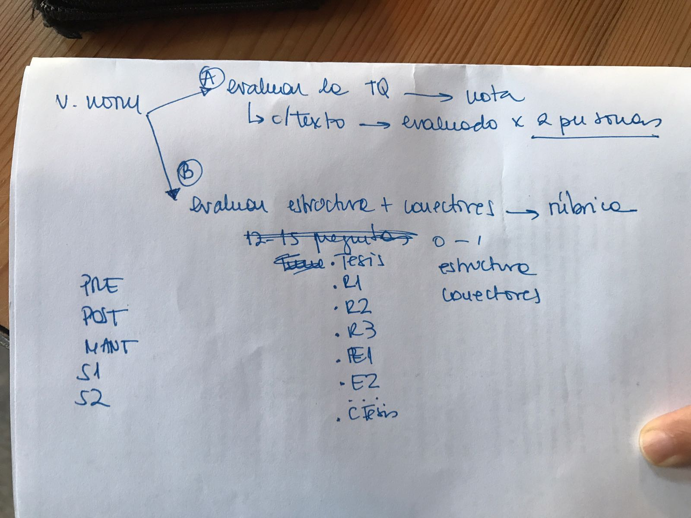

# Text Handler

## Requisitos

### Subida de documentos

* Subir archivos drag&drop
** Momento de la recogida: [pre | post | mant | s1 | s2]
** Especificar el número de la escuela: [01...18]
** Especificar curso: [2 | 4 | 8]

#### Proceso de normalización

* \s. -> [borrar]
* \w+@o -> \w (casa@o -> casa)
* \w+@s -> \s (casa@s -> casa)
* \[%\spunt\] -> . ([%punt] -> .)
* \[%\spunt\sAP\] -> . ([% punt AP] -> .\n\n)
* \[%\ssuspensius\] -> . ([% suspensius] -> ...)
